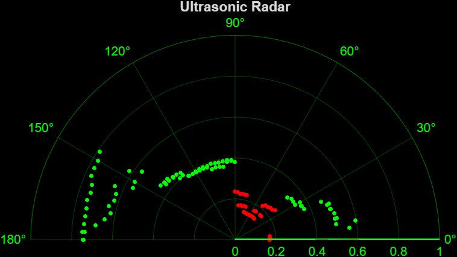

Computational Sensor- Ultrasonic Based 180 Degree 'Radar'

This project makes use of the ultrasonic sensor included in the arduino kit as well as the servo motor to rotate the sensor 180 degrees, and take measurement data of anything the sensor might see. It then plots this data on a polar (r, theta) graph. All data points are saved into vectors, and while they are removed from the plot after a period of time, they remain stored in memory.

The code below is setup to run based on this wiring diagram:
.png)

In order to make use of this sensor, wire the servo and arduino as setup above. The LEDs and buzzer are additional, optional features that will not impact the provided code if not implemented. Once the sensor and servo are setup, you are then able to attach the sensor to the servo, through a platform of some sort. Anything from a piece of cardboard to a 3d-printed specific part will acomplish this task. Then, run this code and place an object in front of the sensor. Notice how plotted points appear on the graph, either green or red depending on the distance from the sensor. The sensor itselft seems fairly consistent from within a 1 meter range, so that is what the code below is using, capping the graph's r-axis at 1 meter and using a 'close distance' threshold of 25 centimeters. Both of these values could be adjusted according to the quality of the sensor being used. On an additional note, to explain the lack of '360' movement, this was simply a choice made due to the servo motor provided by the arduino kit being a more 'accurate' and smooth movement than the stepper motor for our purposes of moving small increments of degrees. 

Example Output Plot:

This is the graph created from taking exactly 180 measurements around 180 degrees, as you can see, there is an object at about half a meter between 0 and 30 degrees, an object closer than 25 cm between about 35 and 90 degrees, an object again at about .6 meters from 90 to about 150 degrees, and then an object at about .8 meters from 150 to 180 degrees. 
